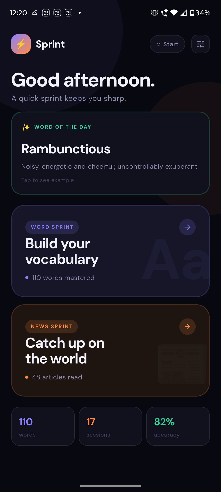
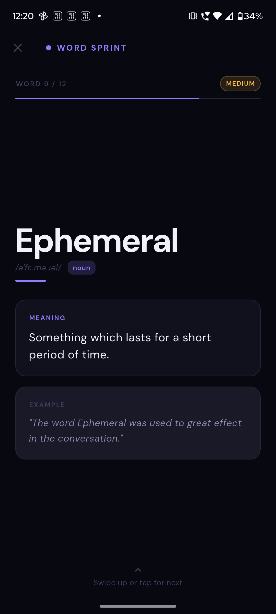
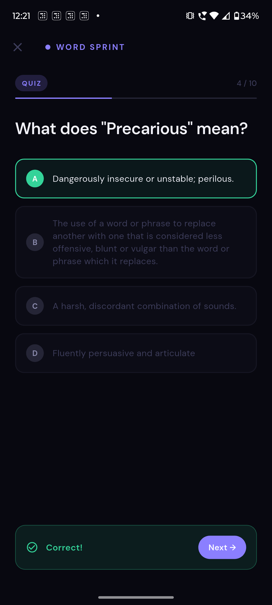
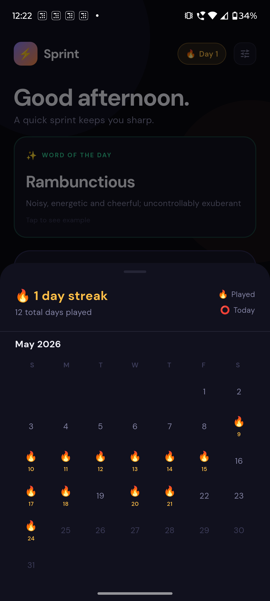
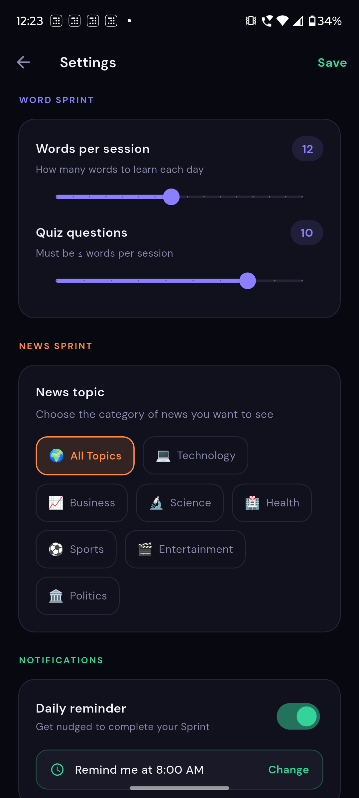

# ⚡ Sprint — Swipe-Based Daily Learning App

> Replace mindless scrolling with intelligent, addictive micro-learning.  
> Live dictionary definitions. Real news. AI-generated quizzes. Zero friction.

---

## Screenshots

| Home Screen | Word Sprint | News Sprint |
|---|---|---|---|
|  |  |  | 

| Word Quiz | Streak Calendar | Settings Page |
|---|---|---|---|
|  |  |  | 

---

## What is this?

Sprint is an Android app built with Flutter that gives you two focused learning modes designed for 5–15 minute morning sessions:

- **Word Sprint** — learn GRE/SAT words per session (configurable) with live dictionary definitions, phonetics, part of speech, and an MCQ quiz at the end
- **News Sprint** — read real news articles fetched fresh daily, then take an AI-generated comprehension quiz based on the actual content
- **Word of the Day** — a daily word from your personal Google Sheets vocabulary collection, shown on the home screen every morning with meaning and example. Works offline after first fetch.

No login. No onboarding. Opens straight to the point.

---

## Prerequisites

- Flutter SDK 3.41+
- Android Studio (for Android SDK)
- Java 17
- A Groq API key (free) — for AI quiz generation
- A NewsAPI key (free) — for live news
- A Google account — for the Word of the Day API (Google Sheets + Apps Script, free)

---

## Installing Flutter

### Windows
```powershell
winget install Google.Flutter
# Restart terminal, then verify:
flutter --version
```

### macOS
```bash
brew install --cask flutter
flutter --version
```

### Linux
```bash
sudo snap install flutter --classic
flutter --version
```

---

## Android Setup

1. Download and install **Android Studio** from https://developer.android.com/studio
2. Open Android Studio and complete the setup wizard (downloads the Android SDK)
3. Go to **Settings → Languages & Frameworks → Android SDK → SDK Tools tab**
4. Check **Android SDK Command-line Tools (latest)** → Apply
5. Set your environment variables:

```powershell
# Windows PowerShell
[System.Environment]::SetEnvironmentVariable("ANDROID_HOME", "$env:LOCALAPPDATA\Android\Sdk", "User")
$current = [System.Environment]::GetEnvironmentVariable("PATH", "User")
[System.Environment]::SetEnvironmentVariable("PATH", "$current;$env:LOCALAPPDATA\Android\Sdk\platform-tools", "User")
```

6. Restart terminal, then accept licenses:
```powershell
flutter doctor --android-licenses
```

7. Verify:
```powershell
flutter doctor
```

---

## API Keys

Create `lib/core/utils/app_config.dart`:

```dart
class AppConfig {
  static const String groqApiKey = 'Bearer gsk_your_key_here';
  static const String newsApiKey = 'your_newsapi_key_here';
  static const String wordOfDayApiUrl = 'https://script.google.com/macros/s/YOUR_SCRIPT_ID/exec';
}
```

This file is gitignored — never commit it.

**Groq** (AI quiz generation — free, no credit card needed):  
https://console.groq.com → API Keys → Create key

**NewsAPI** (live news — free tier):  
https://newsapi.org/register

---

## Running the App

```powershell
# Install dependencies
flutter pub get

# Connect Android phone via USB
# Enable USB Debugging: Settings → About Phone → tap Build Number 7 times
# Settings → Developer Options → USB Debugging → On

# Verify Flutter sees your device
flutter devices

# Run on your phone
flutter run -d <your-device-id>
```

### Daily development workflow
Once `flutter run` is active:
```
r   → hot reload (UI changes, under 1 second)
R   → hot restart (logic/state changes, ~3 seconds)
q   → quit
```

Full rebuild only needed when adding packages or changing `AndroidManifest.xml`.

---

## Building a Release APK

```powershell
flutter build apk --release
# Output: build\app\outputs\flutter-apk\app-release.apk

# Install directly to connected phone:
flutter install
```

---

## Architecture

```
sprint_app/
├── lib/
│   ├── main.dart
│   ├── core/
│   │   ├── theme/app_theme.dart               ← Colors, fonts (DM Sans), design tokens
│   │   └── utils/
│   │       ├── storage_service.dart            ← SharedPreferences: word cache, stats, streak, settings
│           ├── notification_service.dart       ← Push Notifications to the user
│   │       └── app_config.dart                 ← API keys (gitignored)
│   │
│   └── features/
│       ├── home/
│       │   ├── screens/home_screen.dart        ← Home: greeting, streak chip, stats, sprint buttons
│       │   └── widgets/streak_calendar.dart    ← Bottom sheet: 3-month scrollable calendar
│       │
│       ├── settings/
│       │   └── settings_screen.dart            ← Word count, quiz count sliders + news topic picker
│       │
│       ├── word_sprint/
│       │   ├── models/word_model.dart           ← WordModel + fromDictionaryApi factory
│       │   ├── services/
│       │   │   ├── word_sprint_service.dart     ← Parallel API fetch, session logic, quiz gen
│       │   │   └── word_sprint_provider.dart    ← State machine (idle→loading→words→quiz→summary)
│       │   ├── screens/word_sprint_screen.dart
│       │   └── widgets/
│       │       ├── word_card.dart               ← Word, phonetic, POS, meaning, example
│       │       └── quiz_card.dart               ← MCQ with instant feedback
│       │
│       │── news_sprint/
│       │    ├── models/news_model.dart
│       │    ├── services/
│       │    │   ├── news_sprint_service.dart      ← NewsAPI fetch, topic filtering, Groq quiz gen
│       │    │   └── news_sprint_provider.dart     ← State machine
│       │    ├── screens/news_sprint_screen.dart
│       │    └── widgets/
│       │        ├── news_card.dart                ← Article card with Read More link
│       │        └── news_quiz_card.dart           ← AI-generated MCQ with explanation
│       │ 
│       ├── word_of_day/
│       │   ├── models/word_of_day_model.dart      ← WordOfDayModel
│       │   ├── services/word_of_day_service.dart  ← Fetch, day cache, offline fallback
│       │   └── widgets/word_of_day_card.dart      ← Expandable card on home screen    
│
└── assets/data/word_list.json                   ← 315 GRE/SAT word strings (no definitions stored)
```

---

## APIs

### Word Sprint — Free Dictionary API
- **Endpoint:** `https://api.dictionaryapi.dev/api/v2/entries/en/{word}`
- **Auth:** None. Completely free, no key needed.
- **Returns:** Definition, part of speech, phonetic pronunciation, usage examples
- **Caching:** Cached to SharedPreferences on first fetch. Works fully offline after that.

### News Sprint — NewsAPI
- **Endpoint:** `https://newsapi.org/v2/everything?language=en&sortBy=publishedAt`
- **Auth:** Free API key from newsapi.org
- **Cache:** Date-based — fetches once per day, serves from cache for the rest of the day
- **Topic filtering:** User-selectable from Settings (Technology, Business, Science, Health, Sports, Entertainment, Politics, or All)
- **Fallback:** 8 built-in static articles if network fails

### News Quiz — Groq (LLaMA 3.3 70B)
- **Endpoint:** `https://api.groq.com/openai/v1/chat/completions`
- **Auth:** Free API key from console.groq.com
- **What it does:** Reads each article and generates a factual comprehension question with 4 plausible options and an explanation
- **Free tier:** 14,400 requests/day

### Word of the Day — Google Sheets + Apps Script
- **Endpoint:** `https://script.google.com/macros/s/YOUR_ID/exec?action=word_of_day`
- **Auth:** None. Deployed as public Google Apps Script web app.
- **Returns:** Word, meaning, example sentence, difficulty
- **Cache:** Day-based — same word all day, refreshes at midnight
- **Offline:** Falls back to last successfully fetched word if no internet
- **Setup:** Paste your vocabulary into a Google Sheet (columns: word, meaning, example, difficulty) → Extensions → Apps Script → deploy as web app

---

## How Word Sprint Works

```
Session start
  │
  ├─ Load word_list.json (315 strings) — instant, local
  ├─ Select N words (user-configured): 70% unseen + 30% review
  │   └─ If not enough reviewed words, backfills with new words
  │
  ├─ Fetch all definitions in parallel:
  │     ├─ Cached in SharedPreferences? → return instantly (0ms)
  │     └─ Not cached? → GET dictionaryapi.dev → parse → cache → return
  │
  ├─ Swipe through word cards (word, phonetic, POS, meaning, example)
  ├─ Auto-start MCQ quiz (question count user-configured)
  └─ Summary: words learned + accuracy %

From second session onwards: fully offline, all definitions cached.
```

## How News Sprint Works

```
Session start
  │
  ├─ Check date + topic cache → already fetched today for this topic? serve instantly
  ├─ Otherwise: GET newsapi.org with topic filter → summarize → cache for the day
  │
  ├─ Swipe through news cards (headline, summary, Read More link)
  │
  ├─ After last article → Groq generates quiz questions in parallel:
  │     For each article: send title + summary → receive question + 4 options + explanation
  │
  └─ Summary: articles read + quiz score
```

## How Word of the Day Works

```
App open
  │
  ├─ Check day cache → already fetched today? show instantly (0ms)
  │
  ├─ Otherwise: GET Google Apps Script → pick word by day-of-year index
  │     └─ Same word shown to all users on the same calendar day
  │
  ├─ Cache as today's word 
  │
  ├─ Show expandable card on home screen
        ├─ Collapsed: word + meaning (2 lines)
        └─ Expanded: full meaning + example sentence

Word rotates daily. After first successful fetch, works fully offline.
```

## Setting Up Word of the Day

1. Create a new Google Sheet with these columns:

   | A (word) | B (meaning) | C (example) | D (difficulty) |
   |----------|-------------|-------------|----------------|
   | Ephemeral | Lasting for a very short time | Fame is ephemeral in the age of social media | medium |

2. Paste all your words from your vocabulary document into this format

3. Go to **Extensions → Apps Script** in the sheet

4. Paste the Apps Script code (see `/scripts/word_of_day.gs` in this repo)

5. Click **Deploy → New deployment**:
   - Type: Web app
   - Execute as: Me
   - Who has access: Anyone

6. Copy the deployment URL and paste it into `app_config.dart` as `wordOfDayApiUrl`

7. Test in browser: `YOUR_URL?action=word_of_day` — should return JSON with a word

Available actions:
- `?action=word_of_day` — today's word (consistent all day)
- `?action=random` — random word from your collection
- `?action=all` — full word list as JSON

---

## Settings

Accessible via the tune icon (⚙) on the home screen top bar.

| Setting | Default | Range |
|---------|---------|-------|
| Words per session | 12 | 5 – 20 |
| Quiz questions | 8 | 3 – words per session |
| News topic | All | All, Technology, Business, Science, Health, Sports, Entertainment, Politics |

Quiz questions auto-clamp when words per session is reduced below the current quiz count.  
News cache invalidates automatically when topic is changed.

---

## Streak & Calendar

Tap the streak chip (🔥 Day N) on the home screen to open a 3-month scrollable calendar. Days you opened the app are marked with 🔥. Today is marked with ⭕. Streak resets if you miss a day.

---

## Push Notifications

Get notifications as per your convenience - enable them from settings and set a fixed time you'd like the reminder to be sent so you never miss out on your streaks.

---

## Troubleshooting

| Problem | Fix |
|---------|-----|
| `flutter: command not found` | Add Flutter `bin/` to PATH, restart terminal |
| `ANDROID_HOME not found` | Set env var pointing to SDK folder, restart terminal |
| `cmdline-tools component is missing` | Android Studio → SDK Manager → SDK Tools → install Command-line Tools |
| `Unsupported class file major version 65` | Update `gradle-wrapper.properties` to Gradle 8.11.1 |
| `Unknown Kotlin JVM target: 21` | Set `jvmTarget = "17"` in `android/app/build.gradle` |
| `AGP requires 8.9.1 or higher` | Set AGP to `8.9.1` in `settings.gradle`, Gradle to `8.11.1` in wrapper |
| `ic_launcher not found` | Run `flutter create . --platforms=android` to regenerate icons |
| Read More links not opening | Add `https` scheme to `<queries>` block in `AndroidManifest.xml` |
| Words show "No definition available" | Check internet. After first fetch cached and works offline. |
| News not loading | Check NewsAPI key in `app_config.dart`. Falls back to static articles if invalid. |
| Seeing old/wrong news after topic change | Add `clearNewsCache()` call once in provider, hot restart, then remove it |
| Quiz shows fallback questions | Check Groq key has `Bearer ` prefix: `'Bearer gsk_...'` |
| Fonts look wrong on first run | DM Sans downloads via google_fonts on first launch — needs internet once |

---

## Roadmap

| Feature | Status |
|---------|--------|
| Home screen, Word Sprint, News Sprint | Done |
| Live definitions via Free Dictionary API | Done |
| Phonetic pronunciation + part of speech | Done |
| Word definition cache (offline after first use) | Done |
| NewsAPI integration (fresh daily news) | Done |
| AI quiz generation via Groq (LLaMA 3.3 70B) | Done |
| Date + topic based news cache | Done |
| Streak tracking (consecutive days) | Done |
| Streak calendar (3-month scrollable view) | Done |
| Read More links to full articles | Done |
| Settings: word count, quiz count, news topic | Done |
| Push notification daily reminder | Done |
| Word of the Day from personal Google Sheets collection | Done |
| Word of the Day home screen widget | Next |
| iOS support | 🔲 Planned |

---

*Flutter 3.41 · Android 5.0+ · No login · No ads · Let's sprint*